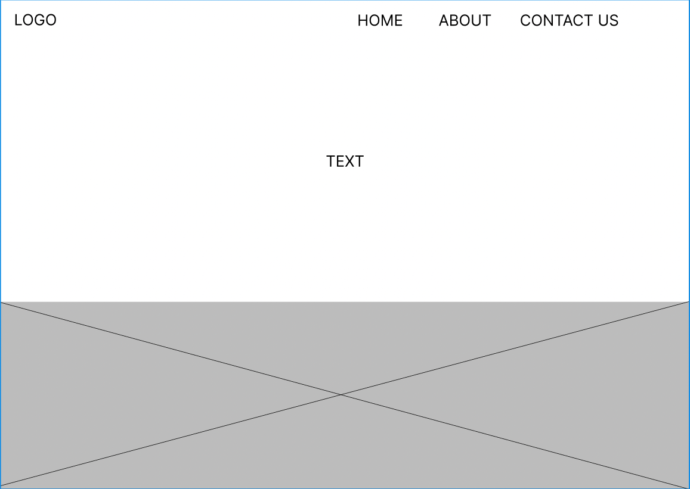
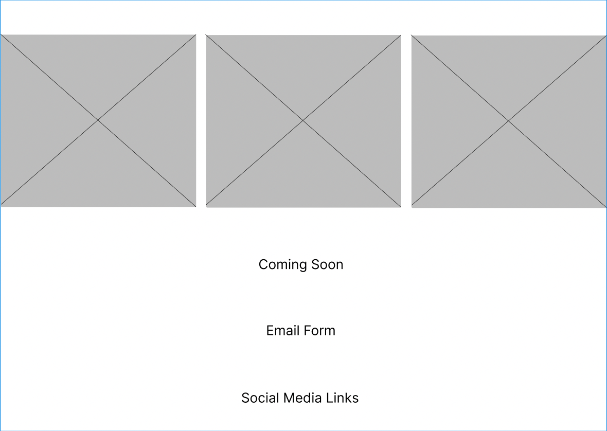

# HTML Wireframing Lab

## Theme
* The idea for this website revolves around a launch for a new season of clothing

## Key Design Elements
* I want a statement written in large font that will entice the viewer to scroll further down the website
* I want a large up close photo of a clothing piece
* Then a sentence or two explaining the inspiration behind the new clothing
* After I want a text saying coming soon
* Then a form asking the email to update the reader of the release

## Low-Fidelity Wireframe
Using Figma I created a wireframe

Page 1:

Page 2:

